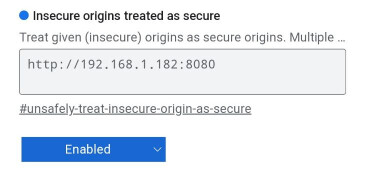

# Revvia - Software to program a Votol controller

A Chromium-based (Chrome and Edge) programmer and data logger using Web Serial API. Used to program your Votol controller if it supports CAN bus. A browser-based clone of the EM_v3-40 tool, with several enhancements.

This is also a PWA, so you could install it and use the software offline.


## For Developers

This project runs like most other typical Node.js projects. First clone or download the repository, then install packages, and finally serve content.

```bash
git clone https://github.com/fidian/revvia.git
cd revvia
npm install
npm run start
```

The server is started at `http://localhost:8080/` and is exposed to everyone on your network through your computer's IP address, which makes testing on mobile devices much easier. The IP address and port will be displayed when the server starts.

**Remote Tunnel:** This will expose your copy of the application to the whole internet behind an SSL-enabled website. Run the server in one terminal and then run `npm run tunnel` in another terminal. Go to the generated URL and enter your *public IP address* as the password. You can use Eruda (see "Debugging" below) and `console.log()` statements. Use `npm run start` in one terminal and `npm run tunnel` in another.

**Android & Chrome:** The easiest way to test is to use a remote tunnel (see above). Another option is to go to `chrome://flags` and look for "Insecure origins treated as secure" (go there directly with `chrome://flags#unsafely-treat-insecure-origins-as-secure`). Add your computer's URL to the exceptions box and change the option to Enabled. The screenshot is how it looks on my device; your IP address will likely be different. You can also hook up a USB cable and enable [remote debugging](https://developer.chrome.com/docs/devtools/remote-debugging).



**Debugging:** [Eruda](https://github.com/liriliri/eruda), a console for mobile browsers, can be loaded two different ways. One is to add "?eruda" to the end of the URL and the other is to tap the "Build Information" header on the info screen ten times. Disabling Eruda will happen automatically with a new session (close the app and open it again), or by tapping the "Build Information" header 10 more times. Turning on and off the console will trigger a page refresh. Eruda will be configured to fully initialize before the application starts, allowing all messages and errors to get logged appropriately. This is extremely useful.
